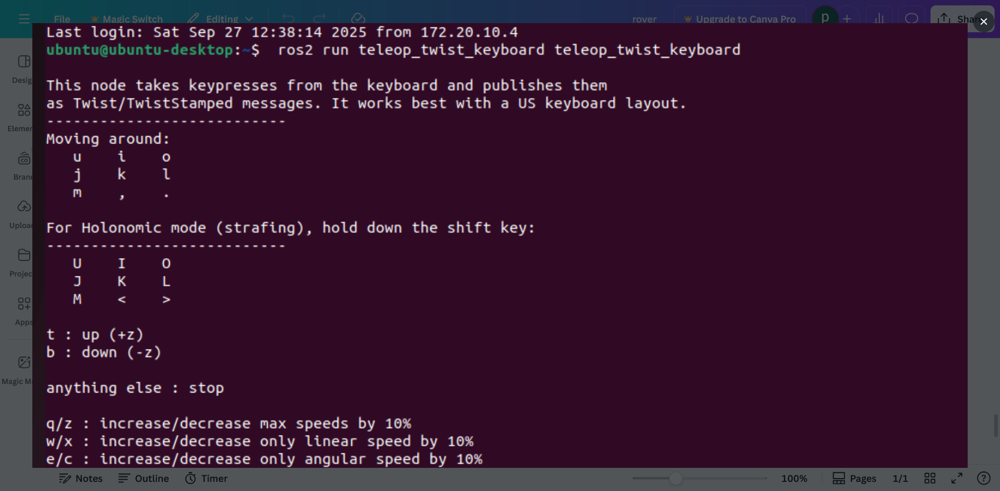
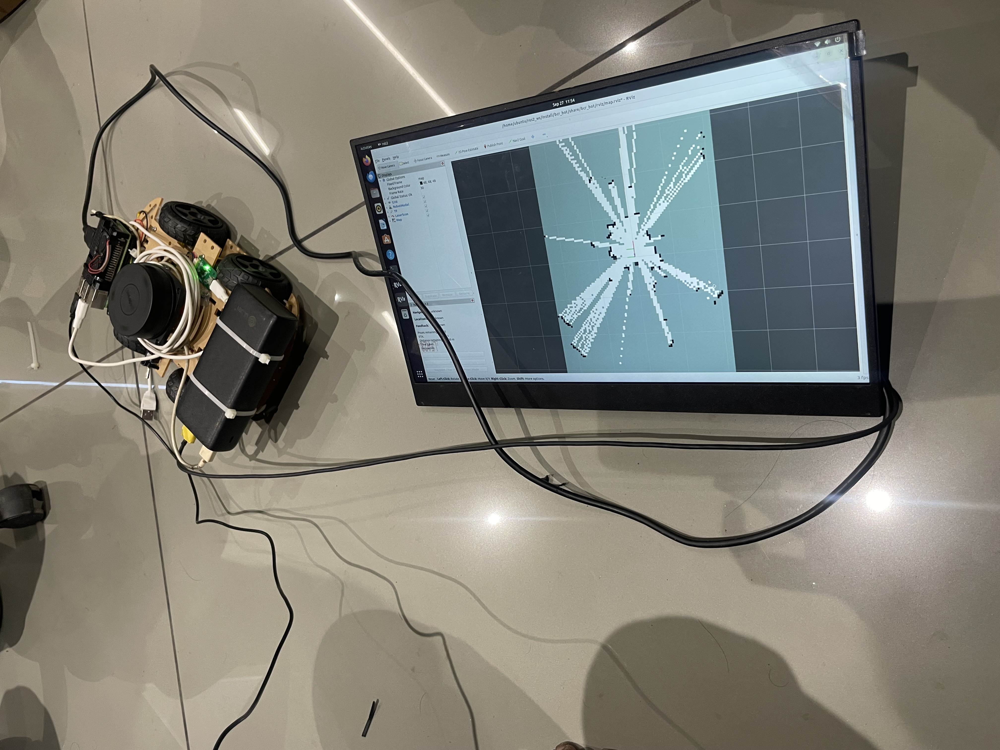

## 🤖 nav2-rover
Raspberry Pi based rover with SLAM & navigation.

- **ROS 2 Humble** on Raspberry Pi
- **SLIDAR** → odometry (`rf2o_odom`)
- **Teleop** publishes `/cmd_vel`
- **Custom ROS node** subscribes to `/cmd_vel`, converts to PWM, and sends serial to Arduino
- **Arduino (ESP32/UNO + L298N)** receives `"linear,angular"`, drives motors
- **Mapping & Navigation** via `slam_toolbox`
- Tested with 6.5 cm wheels, 13 cm wheelbase

Example screenshots:

  


### Workflow
<pre> ```bash 
1. **Teleop**
   ```bash
   ros2 run teleop_twist_keyboard teleop_twist_keyboard
   → publishes /cmd_vel
   
2. **Velocity subscriber**
   ros2 run nav2_rover cmdvel_listener --ros-args -p port:=/dev/ttyUSB0
   
3. **Arduino side (ESP32 / Uno + L298N)**
   - Reads serial input "linear,angular"
   - Converts to PWM (–255 to +255) for left/right wheels
   - Tested with 6.5 cm wheels, 13 cm base width, ~50 RPM motors
   
4. **SLAM**
   ros2 launch nav2_rover mapping.launch.py
   
``` </pre>
**Steps to Do**

   1. ROS2 Humble setup (Raspberry Pi + Laptop)
   2. Implemented /cmd_vel subscriber → serial output
   3. Verified motor actuation (PWM scaling)
   4. SLIDAR working with rf2o_odom
   5. Rover chassis assembly
   6. SSH connection from laptop → Raspberry Pi
   7. Remote teleop tested
   8. Mapping with slam_toolbox
   9. Navigation tuning

**ROS 2 Python package structure in Ubuntu**

<pre> ```bash 
ros2_ws/
└── src/
    └── cmdvel_listener/
        ├── package.xml
        ├── setup.py
        ├── setup.cfg
        ├── resource/
        │   └── cmdvel_listener
        ├── cmdvel_listener/
        │   ├── __init__.py
        │   └── cmdvel_listener.py   <-- node code (CmdVelListener class)
        └── launch/
            └── cmdvel_listener_launch.py   <-- for launching with ros2 launch ``` </pre>

📂 Folder Structure Github
<pre> ```bash 
   Robotics/
│── README.md
│
├── robotic_arm/              # Arm work to pick place objects
│
└── nav2_rover/               # Main rover project 
    │── package.xml
    │── CMakeLists.txt
    │── setup.py
    │
    ├── src/
    │   ├── cmdvel_listener.py    # ROS2 node: subscribe to /cmd_vel & send serial
    │   └── __init__.py
    │
    ├── arduino/
    │   └── cmdvel_listener.ino   # Arduino code for motor control (your working sketch)
    │
    ├── launch/
    │   └── mapping.launch.py     # Example launch for lidar+odom+slam
    │
    ├── config/
    │   └── mapper_params_online_async.yaml  # Tuning for slam_toolbox
    │
    └── images/
    |   ├── rover-top-view.jpg
    |   ├── rover-side-view.jpg
    |   ├── rover-gazebo-mapping.jpg
    ├
    │
    └── screenshots/
        ├── bcr-bot-cmd-terminal.png
        ├── cmdvel-listener.png
        ├── remmina-remote-desktop.png
        └── rf2o-laser-odom.png
        ├── ssh-raspberry-pi.png
        └── teleop-twist-keyboard.png ``` </pre>
