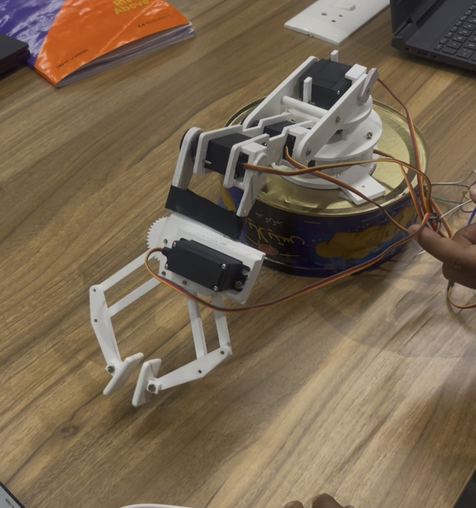

# Robotic Arm — Pick & Place (ESP32)

**Short:** ESP32 + MG995 robotic arm performing a simple pick & place demo.  
Contains Arduino code (`app.ino`), video demo.

- **Hardware**
  - ESP32 Dev Board (e.g., ESP32-WROOM-32)
  - 5 × MG995 servos (Shoulder, Wrist, Elbow, Gripper, Base)
  - External servo power supply (5–7.4V, high current, >2A recommended)
  - Common ground between ESP32 and servo power
  - Jumper wires, breadboard, chassis/arm frame

- **Software**
  - [Arduino IDE](https://www.arduino.cc/en/software) (or PlatformIO)
  - ESP32 board package installed in Arduino IDE
  - Library: [ESP32Servo](https://github.com/madhephaestus/ESP32Servo)

- **Setup**
  - Connect servo signal pins:
    - Shoulder → GPIO13
    - Wrist → GPIO12
    - Elbow → GPIO15
    - Gripper → GPIO14
    - Base → GPIO27
  - Upload `app.ino` to ESP32
  - Provide separate power for servos (do **not** power from ESP32 5V pin)

### Why MG995 is tricky

MG995 servos are marketed as "360°" but behave differently than normal positional servos.  
A simple `servo.write(angle)` command does not move the servo at a controlled speed — it jumps toward the new position at its maximum speed.  

This makes it very challenging to control **speed** with just angle inputs.  

👉 To control speed, you must move the servo incrementally from current → target at timed steps (a ramp). 
**speed = distance / time**   

Calculate the distance (degrees), decide the time you want (ms), then break the move into steps with delays in between. That’s the basis for smooth motion control in robotic arms. 
